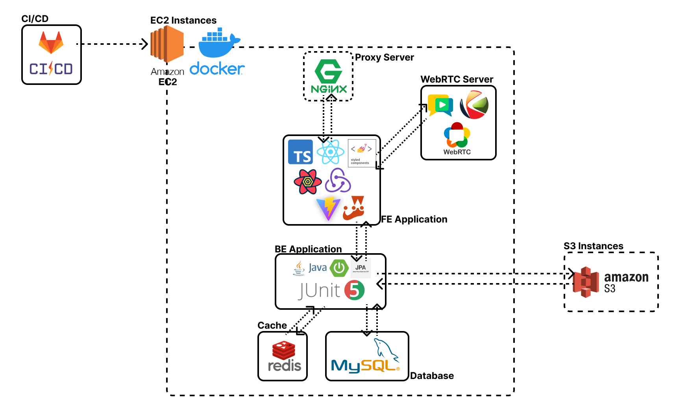
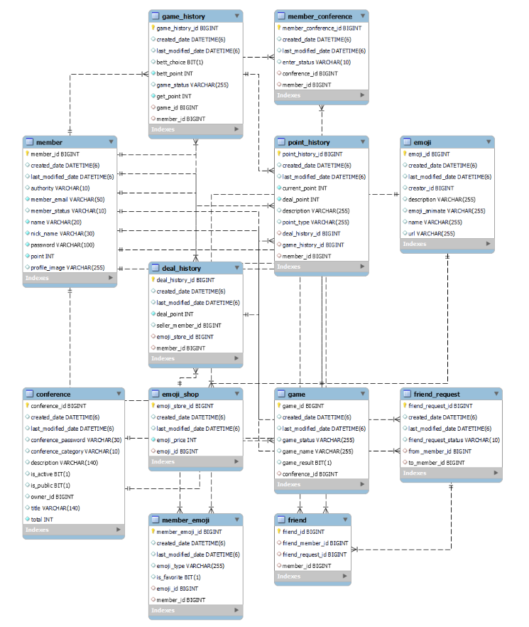

# hool!

- 서비스 특징: 커스텀 이모지와 가벼운 게임을 통해 스포츠 중계를 함께 보는듯한 경험을 선사합니다.

- 주요 기능

  - 응원 세션 생성/참가

  - 다이나믹 이모지

  - 포인트(큐브)

  - 승자가 패자의 큐브를 획득 가능한 내기 게임 생성

  - 친구(소셜)

  - 친구 따라가기

  - 간단한 게임

  

<!-- 자유 양식 -->

## :family: 팀 소개

|                                                한승재                                                |                                                전한울                                                |                                                박상태                                                 |                                                신은정                                                |                                               안호진                                               |                                                이승호                                                 |
| :--------------------------------------------------------------------------------------------------: | :--------------------------------------------------------------------------------------------------: | :---------------------------------------------------------------------------------------------------: | :--------------------------------------------------------------------------------------------------: | :------------------------------------------------------------------------------------------------: | :---------------------------------------------------------------------------------------------------: |
|  |  |  |  |  |  |

  

<!-- 자유 양식 -->

## :mag: 프로젝트 상세 설명

### :computer: 개발 환경

#### FE

#### BE

 

### :building_construction: 기술스택/아키텍처

 

### :card_file_box: ERD

 

### 구현 기능 화면

#### 1. 회원 가입

1. 메일 인증코드 보내기

2. 인증 코드 확인

3. 회원 가입

4. 로그인

5. 소셜로그인

### 2. 응원방 리스트

1. 메인화면

### 3. 프로필

1. 포인트 내역

2. 즐겨찾기 등록 / 해제

3. 이모지 등록

4. 프로필 편집

### 4. 이모지 상점

1. 이모지 상점 전체

2. 이모지 상점 top10

3. 이모지 구매

4. 이모지 판매

### 5. 친구 페이지

1. 친구 요청 보내기

2. 친구 요청 받기

3. 친구 따라가기

### 6. 응원방 만들기

1. 응원방 만들기

### 7. 응원방 페이지

1. 이모지 사용

### 8. 예측 게임 기능

1. 방장 게임 생성 및 참여

2. 게임 참가

3. 방장 게임 결과

