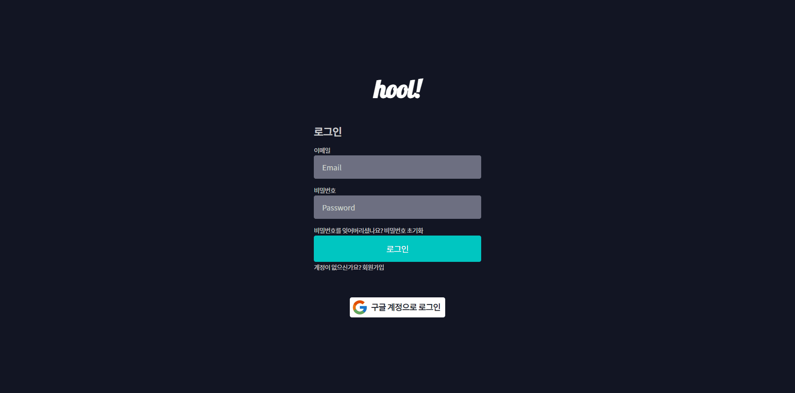
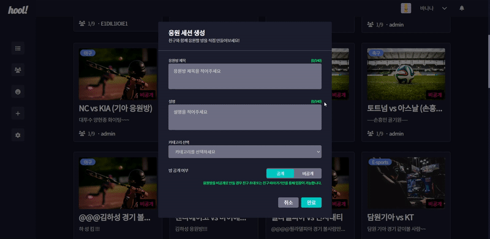

## **시나리오(only)**

---

**회원가입**

- SMTP를 통한 이메일 본인 인증 후 회원가입

**로그인** - 구글 로그인 가능

**응원 방 리스트**

- 메인 페이지에 생성된 응원 방들이 보입니다.
- 응원 방 리스트는 응원방 각각의 썸네일, 제목, 설명, 현재 참가 인원, 방장 닉네임 정보를 표시합니다.
- 왼쪽에 순서대로 메인 페이지, 친구 페이지, 이모지 상점 페이지, 응원 방 만들기, 설정 버튼이 있습니다.
- 오른쪽 상단에 로그인을 안 했을 경우 로그인이 했을 경우 프로필 이미지와 별명이 나옵니다. 해당 UI에 마우스를 호버할 경우 프로필과 로그아웃이 나옵니다.

**프로필**

- 나의 정보를 확인할 수 있고, 프로필 이미지와 회원 닉네임이 수정 가능합니다.
- 보유 중인 포인트(큐브), 이모지 갯수, 친구 수를 확인할 수 있습니다.
- 보유 중인 이모지를 확인할 수 있고 이모지에 마우스 호버를 하면 이모지 애니메이션을 볼 수 있습니다. 이모지를 클릭하면 상세정보를 볼 수 있고 즐겨찾기 등록을 할 수 있습니다.
- 즐겨찾기를 클릭하면 즐겨찾기 목록을 알 수 있고 보유중인 이모지와 마찬가지로 애니메이션 및 정보를 알 수 있습니다.
- 직접 이모지를 등록할 수 있습니다. 이모지 파일(jpg, png, gif), 이름, 애니메이션, 설명을 작성하여 이모지를 등록합니다.

**이모지 상점**

- 보유 중인 큐브를 이용해 이모지를 거래할 수 있습니다.
- Top 10 탭에서는 현재 가장 많이 팔린 이모지 10개를 보여줍니다. 이모지 상세정보가 보여집니다.
- 전체 목록을 클릭하면 전체 이모지를 최신순으로 보여줍니다.
- 오른쪽 상단에 이모지 이름으로 이모지 검색이 가능합니다.
- 이모지에 마우스 호버를 하면 이모지 애니메이션을 볼 수 있고 해당되는 이모지를 구매 버튼을 클릭하면 구매할 수 있습니다.
- 상품등록을 클릭하면 직접 등록한 이모지들 중 이모지 상점에 등록하지 않은 이모지 리스트가 나옵니다. 원하는 가격을 작성해서 등록하면 이모지 상점에 등록됩니다.

**친구 페이지**

- 내 친구 목록을 확인할 수 있고 친구의 별명, 이메일, 접속 여부, 최종 접속 시간을 보여줍니다.
- 친구 검색으로 유저를 검색하여 친구 요청을 보낼 수 있습니다.
- 친구요청을 클릭하면 본인에게 온 친구요청을 확인하고 수락 또는 거절을 할 수 있습니다.
- 추가된 친구 목록에는 각 친구마다 따라가기 메뉴를 선택할 수 있습니다. 친구가 응원방에 들어가 있는 경우 그 응원방에 따라 들어가는 것이 가능합니다.

**응원 방 만들기**

- 응원 방 제목, 설명, 카테고리, 공개 여부를 작성하여 방을 생성할 수 있습니다. 비공개일 경우 비밀번호를 작성하여 원하는 유저들만 출입 가능하게 할 수 있습니다.

**응원 방 페이지**

- 왼쪽에 순서대로 마이크와 카메라 , 채팅(이모지) ON/OFF 기능, 예측 게임 생성(방장만), 설정 버튼이 있습니다.
- 비디오를 시작할 경우 화면 가운데에 화상
- 채팅 버튼 클릭 시 채팅창이 생깁니다. 참가자들과 채팅을 통해 대화할 수 있습니다.
- 채팅 입력 창 위 이모지 버튼을 클릭 시 즐겨찾기한 이모지들을 사용할 수 있습니다. 이모지는 자신의 비디오 가운데에 나타나게 됩니다.
- 방장의 경우 게임 생성 버튼을 클릭하면 예측 게임을 생성할 수 있습니다.

**예측 게임 기능**

- 방장이 게임 제목을 작성하고 가능한 결과를 두 가지로 작성하고 제출 시간을 정하여 예측 게임을 만듭니다.
- 방장이 예측 게임을 만들 경우 참가자들에게 게임이 화면 가운데에 생깁니다. 제출 시간 내 가능한 결과에 투표하여 게임에 참가할 수 있습니다.
- 제출 시간이 지나면 참가자들의 베팅 통계를 볼 수 있습니다.
- 방장이 예측 게임의 결과를 결정하면 참가자들의 베팅 결과에 따른 포인트가 분배됩니다.

**포인트(큐브)**

- 이모지를 살 때 포인트가 차감되고 자신이 이모지 상점에 등록한 이모지가 팔릴 경우 포인트가 증가합니다.
- 예측 게임을 참가하여 승리할 경우 분배된 포인트를 얻게되고 패배할 경우 포인트가 차감됩니다.

## **시나리오(with 스크린샷)**

---
### 1. 회원 가입

1. 메일 인증코드 보내기

2. 인증 코드 확인

3. 회원 가입

4. 로그인

5. 소셜로그인

### 2. 응원방 리스트
1. 메인화면

### 3. 프로필

1. 포인트 내역

2. 즐겨찾기 등록 / 해제

3. 이모지 등록

4. 프로필 편집

### 4. 이모지 상점
1. 이모지 상점 전체

2. 이모지 상점 top10

3. 이모지 구매

4. 이모지 판매

### 5. 친구 페이지

1. 친구 요청 보내기

2. 친구 요청 받기

3. 친구 따라가기

### 6. 응원방 만들기
1. 응원방 만들기

### 7. 응원방 페이지
1. 이모지 사용

### 8. 예측 게임 기능
1. 방장 게임 생성 및 참여

2. 게임 참가

3. 방장 게임 결과

